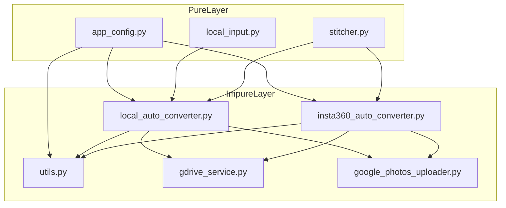
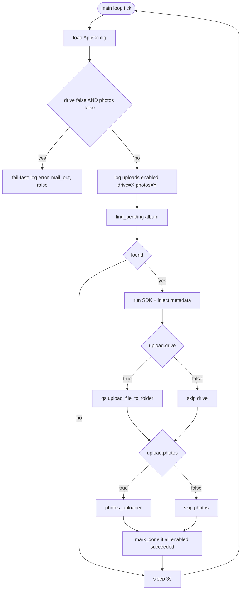

# Design: selective-upload-targets

## Overview

ローカル入力モードでの **Drive / Photos アップロード先の個別 on/off** と、
プロジェクト全体の **設定ファイルを INI (`configs.txt`) から YAML (`configs.yaml`) へ移行** を、
1 つの spec として整合的に実装する。両者は同じ config レイヤーを触るため、**1 PR / 1 移行** で運用者負担を最小化する。

設計の中心は、新規 pure モジュール **`apps/app_config.py`** に YAML ロード + 検証 + dataclass 化を集約し、
既存の `ConfigParser` 直叩きを 3 ファイル (utils.py / insta360_auto_converter.py / local_auto_converter.py) で
統一的に置き換えること。toggle ロジックは `process_pending` に **`UploadTargets` 値オブジェクト** を渡す形で
注入する (テスト容易性 + simplicity)。

## Goals / Non-Goals

### Goals

- ローカル入力モードで `upload.drive` / `upload.photos` を独立に切替できる
- `configs.yaml` を Single Source of Truth にし、フェイルファストで起動時検証する
- 既存テスト (`test_local_auto_converter.py` など) を壊さず、追加テストで挙動の差分を担保する
- README にマイグレーション手順を提示し、運用者が手作業で INI → YAML へ移行できる

### Non-Goals

- Drive モード (`insta360_auto_converter.py`) のアップロード先 toggle 追加
- 動作中の hot-reload や config 変更検知
- アップロード先プラグイン化 (3 つ目の上げ先導入)
- `apps/in_app_configs.conf` の YAML 化
- 認証 JSON (`auto-conversion.json` / `gphotos_auth.json`) の形式変更
- マルチテナント / Web UI / クレデンシャル暗号化

## Boundary Commitments

本 spec が **所有する責務**:

1. YAML 設定のロード・スキーマ検証・型付き dataclass 化 (`apps/app_config.py`)
2. `process_pending` における Drive / Photos アップロード呼び出しのゲート判定
3. 既存 3 モジュール (`utils.py` / `insta360_auto_converter.py` / `local_auto_converter.py`) の config 読み込みパターンを YAML 経由に置き換える
4. `configs.yaml.sample` および README の移行手順セクション
5. 不正設定 (両方 false / 必須キー欠落 / YAML パース失敗) の起動時検出と運用者通知

### Out of Boundary

- Drive モードのアップロード先選択ロジック (Drive モードは元から Photos のみで挙動不変)
- `apps/in_app_configs.conf` の形式 (アプリ内デフォルト、リポジトリ管理側、別 spec で議論)
- `auto-conversion.json` / `gphotos_auth.json` の Google API 由来形式
- 動作中の hot-reload や `SIGHUP` ハンドリング
- アップロード先の追加 (3 つ目の宛先)
- 環境変数経由での toggle 上書き

### Allowed Dependencies

- 新規追加: **PyYAML >= 6.0** (MIT、`yaml.safe_load` 使用)
- 既存維持: `google-api-python-client`, `google-auth-oauthlib`, `requests-toolbelt`, `moviepy<2.0`, stdlib
- Dev: `pytest`, `ruff` (既存)

新たな外部 API / クラウドサービス呼び出しは追加しない。

### Revalidation Triggers

以下の変更が要件として上がってきた場合、本設計を再検証する必要がある:

- 3 つ目以上のアップロード先追加 (UploadTargets を可変長コレクションに変更要)
- 動作中 hot-reload (loader API を `watchdog` 連携やシグナル対応に再設計)
- マルチテナント (複数プロファイルの YAML、env による切替)
- Drive モードでも upload toggle を求める要件 (Drive モードのオーケストレータ側にも `UploadTargets` 注入が必要)

## Architecture

### Dependency Direction

```
Types/Dataclasses (apps/app_config.py)
        ↓
Config Loader (apps/app_config.py)
        ↓
   ┌────┼────────────────────────┐
   ↓    ↓                        ↓
utils.py  insta360_auto_converter.py  local_auto_converter.py
   ↑                                          ↓
   └─────── log() / send_mail() ←──── process_pending()
```

- 上から下、左から右への依存のみ許可
- `app_config.py` は **stdlib + PyYAML のみに依存**、他のアプリモジュールに依存しない (テスト容易性確保)
- `utils.py` は `app_config.py` に依存するが逆方向は禁止
- 各エントリポイント (`*_auto_converter.py`) はモジュールロード時に `app_config.load_app_config()` を呼ぶ

### Component Diagram



### Process Flow (local mode toggle gating)



## File Structure Plan

| ファイル | 状態 | 責務 |
|---|---|---|
| `apps/app_config.py` | **新規** | YAML ロード、必須キー検証、`AppConfig` / `UploadTargets` / `GdriveConfig` / `GmailConfig` dataclass、`AppConfigError` 例外 (pure) |
| `apps/utils.py` | 改修 | `ConfigParser` 削除、`load_app_config()` 経由で SMTP 認証を取得。`log()` / `send_mail()` の外部 API は不変 |
| `apps/insta360_auto_converter.py` | 改修 | `ConfigParser` 削除、`load_app_config()` 経由で Drive ID と working_folder_id を取得。挙動は不変 |
| `apps/local_auto_converter.py` | 改修 | `process_pending` に `upload_targets: UploadTargets` 引数を追加し、Drive / Photos 呼び出しをゲート。`main()` で起動時にトグルログ + 両 false 検出 |
| `tests/test_app_config.py` | **新規** | YAML ロード正常系、必須キー欠落、両 toggle false、パース失敗、env 経由のパス差替 (Tier 1 pure 関数群) |
| `tests/test_local_auto_converter.py` | 改修 | toggle on/off 組合せでの呼び出し検証、片方失敗時の `.done` 未作成検証を追加 |
| `tests/conftest.py` | 改修 | `INSTA360_CONFIGS_PATH` を tmp YAML に向けるための共通 fixture を追加 |
| `tests/test_utils.py` | 改修 | YAML 経由 SMTP 設定の取得、`mail_out=True` のキー参照リグレッション |
| `configs.yaml.sample` | **新規** (リポジトリ直下) | 全必須キーをプレースホルダ値で記載 |
| `README.md` | 改修 | "Migrating configs.txt to configs.yaml" セクション追加。INI セクション → YAML キー対照表 |
| `.envrc.sample` | 改修 | `configs.txt` 言及を `configs.yaml` に更新 (もし参照があれば) |
| `pyproject.toml` | 改修 | `dependencies` に `pyyaml>=6.0` 追加 |

**Boundary 整合性チェック:** `apps/in_app_configs.conf` および認証 JSON は変更しない (Out of Boundary)。
変更ファイルはすべて Boundary Commitments に属する。

## Components & Interfaces

### Component Summary

| Component | Domain | Intent | Requirements | Key Dependencies | Contracts |
|---|---|---|---|---|---|
| AppConfigLoader | config | YAML ロードと検証、型付き AppConfig 返却 | 3.1, 3.2, 3.3, 3.4, 3.5 | PyYAML (Outbound, P0), stdlib (Outbound, P2) | Service (関数 API) |
| LocalUploadGate | local mode | `process_pending` 内で UploadTargets に基づき Drive / Photos の呼出を選択 | 1.1–1.5, 2.1–2.4, 4.2 | AppConfigLoader (Inbound, P0), GDriveService (Outbound, P0), gphotos (Outbound, P0) | Service |
| LocalStartupValidator | local mode | `main()` 起動時に両 toggle false 検出 + UploadTargets ログ出力 | 1.6, 4.1, 4.3 | AppConfigLoader (Inbound, P0), Utils.log (Outbound, P1) | Service |
| DriveModeConfigConsumer | drive mode | `insta360_auto_converter.py` の config 取得を YAML 経由に置換 | 3.4 | AppConfigLoader (Inbound, P0) | Service |
| UtilsMailConsumer | logging/mail | `send_mail` の SMTP 認証取得を YAML 経由に置換 | 3.4, 4.3 | AppConfigLoader (Inbound, P0) | Service |
| ConfigSampleAndDocs | docs | `configs.yaml.sample` + README 移行セクション | 5.1, 5.2, 5.3 | (none) | (artifact) |

### AppConfigLoader (`apps/app_config.py`)

**Intent:** YAML 設定ファイルを読み込み、必須キーを検証し、不変な型付き dataclass を返す。

**Public API (Python type hints):**

```python
from dataclasses import dataclass
from pathlib import Path

@dataclass(frozen=True)
class GdriveConfig:
    drive_id: str
    working_folder_id: str

@dataclass(frozen=True)
class GmailConfig:
    address: str
    password: str
    error_mail_to: str

@dataclass(frozen=True)
class UploadTargets:
    drive: bool
    photos: bool

    def has_any_enabled(self) -> bool: ...

@dataclass(frozen=True)
class AppConfig:
    gdrive: GdriveConfig
    gmail: GmailConfig
    upload: UploadTargets

class AppConfigError(RuntimeError):
    """Raised on missing key, parse failure, or invalid combination."""

DEFAULT_CONFIG_PATH: Path = Path("/insta360-auto-converter-data/configs.yaml")

def load_app_config(path: Path | None = None) -> AppConfig: ...
def format_upload_targets(targets: UploadTargets) -> str: ...
```

**契約:**

- `path is None` の場合は `INSTA360_CONFIGS_PATH` 環境変数を参照、未設定なら `DEFAULT_CONFIG_PATH`
- ファイル不在 / パース失敗 / 必須キー欠落 / 両 toggle false の場合 `AppConfigError` を送出 (メッセージにキー名 or パス を含む)
- 型情報: 全フィールド strict (`bool` でない場合エラー、空文字列も許容しない)
- ロードは副作用なし (env 読み + ファイル I/O 以外)、複数回呼出し可能 (テスト用)

**Errors:** `AppConfigError` のメッセージ形式 (例):
- `"configs.yaml not found at /path/to/configs.yaml"`
- `"failed to parse configs.yaml: <yaml.YAMLError>"`
- `"required key 'gdrive.drive_id' is missing in configs.yaml"`
- `"upload.drive and upload.photos are both false; at least one must be enabled"`

**Implementation Notes:**

- **Integration:** 起動時にエントリポイント (`*_auto_converter.py:main()`) 直前 / `utils.py` モジュールロード時で呼ばれる
- **Validation Hooks:** unit test で「全必須キー網羅」「型エラー検知」「両 toggle false」「ファイル不在」を回す
- **Risks:** `utils.py` がモジュールロード時に YAML を読むため、テストで `INSTA360_CONFIGS_PATH` を tmp に向けないと import が落ちる → conftest.py で fixture 化

### LocalUploadGate (`apps/local_auto_converter.py:process_pending`)

**Intent:** SDK 変換が成功した raw について、`UploadTargets` に従って Drive / Photos の各呼出をゲートする。

**Service signature 変更:**

```python
def process_pending(
    pending: dict,
    working_folder: str,
    drive_parent_id: str,
    gs: GDriveService | None,
    sdk_runner: SdkRunner,
    upload_targets: UploadTargets,
    photos_uploader: PhotosUploader = gphotos.upload_to_album,
    split_outputs: list[str] | None = None,
) -> None: ...
```

**契約:**

- `upload_targets.drive == True` の場合のみ `gs.get_or_create_subfolder` および `gs.upload_file_to_folder` を呼ぶ
- `upload_targets.photos == True` の場合のみ `photos_uploader(...)` を呼ぶ
- 有効な上げ先がすべて成功したときのみ `mark_done(left)` を呼ぶ
- 有効な上げ先のうち 1 つでも失敗した場合は例外を再送出し、`mark_done` は呼ばない
- `upload_targets.drive == False` のとき `gs` が `None` でも例外にならない (Drive コードパスをスキップ)

**Errors:** Drive / Photos いずれかの upload が例外を上げた場合、その例外を呼出元へ伝播する (既存と同じ)。

**Implementation Notes:**

- **Integration:** `main()` 側で `AppConfig.upload` を取得し `process_pending(..., upload_targets=cfg.upload, ...)` で渡す
- **Validation Hooks:** test_local_auto_converter.py に「(T,F)/(F,T)/(T,T)」「片方失敗時の `.done` 未作成」「`gs is None` で `drive=False`」「両方成功で marker 作成」を追加
- **Risks:** 既存テストの `process_pending(...)` 呼出が増えた引数で壊れる。**TDD 原則どおり、テストを先に直してから実装** (新引数を必須にし、既存テストで `UploadTargets(drive=True, photos=True)` を明示的に渡す)

### LocalStartupValidator (`apps/local_auto_converter.py:main`)

**Intent:** `main()` 起動時に config を読み込み、両 toggle false の場合は即座にフェイルファスト。実行可能な場合はトグル状態を info ログに残す。

**Behavior:**

- `cfg = load_app_config()` を `main()` 冒頭で呼ぶ
- `cfg.upload.has_any_enabled() is False` なら `log("upload.drive and upload.photos are both false; ...", mail_out=True)` 後に `raise SystemExit(1)`
- 主ループ突入直前に `log("uploads enabled: drive={cfg.upload.drive}, photos={cfg.upload.photos}")` を info で 1 回出す
- `INSTA360_LOCAL_INPUT_ROOT` の解決は既存ロジックを保持

**Errors:** `AppConfigError` も同様に `mail_out=True` のメール通知 + 終了 (Req 4.3)。

### DriveModeConfigConsumer (`apps/insta360_auto_converter.py`)

**Intent:** モジュールロード時の `ConfigParser` を `load_app_config()` に置換。

**変更点:**

- ファイル先頭の `config = ConfigParser(); config.read("/insta360-auto-converter-data/configs.txt")` を `_app_config = load_app_config()` に置換
- `main()` 内の `config["GDRIVE_INFO"]["drive_id"]` 等を `_app_config.gdrive.drive_id` に置換
- 挙動 (Drive モードのアップロード先) は変更なし

**Validation:** Drive モードの既存テストが無ければ動作確認は手動 (Docker)。Boundary 上、Drive モードの toggle ロジックは追加しない。

### UtilsMailConsumer (`apps/utils.py`)

**Intent:** モジュールロード時の `ConfigParser` を `load_app_config()` に置換。`log()` の外部 API は不変。

**変更点:**

- ファイル先頭の `config = ConfigParser()` 関連を `_app_config = load_app_config()` に置換
- `send_mail()` 内の `config["GMAIL_INFO"]["pass"]` 等を `_app_config.gmail.password` 等に置換
- `log()` および `silentremove()` のシグネチャは変更なし

**Risks:** `app_config.py` のロードに失敗すると `utils.py` の import が失敗 → 全モジュールが落ちる。これは「フェイルファスト」設計として **意図通り**。テスト時は `INSTA360_CONFIGS_PATH` を tmp YAML に向けて回避。

### ConfigSampleAndDocs

**Intent:** 運用者が YAML 移行を実行できるよう、サンプルファイルと README セクションを提供。

**Artifacts:**

1. `configs.yaml.sample` (リポジトリ直下) — 例:

```yaml
gdrive:
  drive_id: "0AB-REPLACE-WITH-YOUR-SHARED-DRIVE-ID"
  working_folder_id: "1xy-REPLACE-WITH-WORKING-FOLDER-ID"
gmail:
  address: "alerts@example.com"
  password: "REPLACE-WITH-APP-PASSWORD"
  error_mail_to: "ops@example.com"
upload:
  drive: true
  photos: true
```

2. `README.md` への追記 — "Migrating from configs.txt to configs.yaml" セクション。INI セクション → YAML キーの対照表 (research.md I2 と同等)、`[YOUTUBE_SETTINGS]` は廃棄、`upload.*` は新規キー、両方 false は禁止、を明記。

3. `.envrc.sample` 内の `configs.txt` 言及をすべて `configs.yaml` に書き換え (該当箇所があれば)。

## Data Models

### Domain Model

```
AppConfig
├── gdrive: GdriveConfig
│   ├── drive_id: str
│   └── working_folder_id: str
├── gmail: GmailConfig
│   ├── address: str
│   ├── password: str
│   └── error_mail_to: str
└── upload: UploadTargets
    ├── drive: bool
    └── photos: bool
```

すべての値オブジェクトは `@dataclass(frozen=True)`。`AppConfig` 全体が不変であり、起動後に変更されない。

### Logical Schema (configs.yaml)

YAML 表現と上記 dataclass の 1:1 対応。`safe_load` 経由でロードし、各 `dict` を dataclass に手動マップする (簡素な validator)。

**型契約:**

- `gdrive.drive_id` / `gdrive.working_folder_id`: 非空文字列
- `gmail.address` / `gmail.password` / `gmail.error_mail_to`: 非空文字列
- `upload.drive` / `upload.photos`: bool (YAML の `true` / `false` をそのまま受ける)

未知のキーは検証時に warning にとどめ、エラーにしない (将来の拡張余地)。

## Error Handling

| 失敗ケース | 検出箇所 | 振る舞い |
|---|---|---|
| `configs.yaml` 不在 | `AppConfigLoader` | `AppConfigError(message=...path...)` 送出。エントリポイントで `mail_out=True` ログ後 SystemExit |
| YAML パース失敗 | `AppConfigLoader` | `AppConfigError(message=...parse error...)` 送出。同上 |
| 必須キー欠落 | `AppConfigLoader` | `AppConfigError(message="required key 'X.Y' is missing")` 送出。同上 |
| 型不一致 (例: `upload.drive` が文字列) | `AppConfigLoader` | `AppConfigError(message="upload.drive must be a boolean, got str")` 送出 |
| `upload.drive` と `upload.photos` が両方 false | `AppConfigLoader` | `AppConfigError(message="upload.drive and upload.photos are both false; ...")` 送出 |
| Drive アップロード失敗 (toggle on) | `LocalUploadGate` | 既存挙動: 例外を呼出元に伝播、`.done` 作成しない |
| Photos アップロード失敗 (toggle on) | `LocalUploadGate` | 同上 |
| Drive 呼出スキップ (toggle off) | `LocalUploadGate` | エラー扱いしない、メール通知しない (info ログのみ) |

**メール通知ポリシー (Req 4.2 / 4.3):**

- toggle off によるスキップは **エラー扱いしない** (info ログ、メール飛ばさない)
- 起動時の config エラーは `mail_out=True` で運用者へ通知
- 既存のアップロード失敗時のメール通知は変更なし

## Testing Strategy

### Unit (Tier 1: 必須)

| テスト | 対象 | 検証内容 | Requirements |
|---|---|---|---|
| `test_load_app_config_valid_yaml` | `load_app_config` | 正常 YAML を渡すと AppConfig が返る | 3.1, 3.4 |
| `test_load_app_config_missing_file` | `load_app_config` | ファイル不在で AppConfigError、メッセージにパス含む | 3.2, 3.5 |
| `test_load_app_config_malformed_yaml` | `load_app_config` | パース失敗時に AppConfigError | 3.2 |
| `test_load_app_config_missing_required_key` | `load_app_config` | 必須キー (gdrive.drive_id 等) 欠落で AppConfigError、キー名含む | 3.3 |
| `test_load_app_config_both_uploads_false` | `load_app_config` | `upload.drive=false, upload.photos=false` で AppConfigError | 1.6 |
| `test_load_app_config_env_path_override` | `load_app_config` | `INSTA360_CONFIGS_PATH` でパス上書き | (テスト容易性) |
| `test_load_app_config_no_fallback_to_ini` | `load_app_config` | `configs.yaml` 不在 + `configs.txt` 存在の状況で **AppConfigError** (フォールバックしない) | 3.5 |
| `test_process_pending_drive_only` | `process_pending` | `UploadTargets(drive=True, photos=False)` で photos_uploader 未呼出 / drive 呼出あり / `.done` 作成 | 1.4, 1.5, 2.1, 2.4 |
| `test_process_pending_photos_only` | `process_pending` | `UploadTargets(drive=False, photos=True)` で gs 関連未呼出 / photos 呼出あり / `.done` 作成 | 1.2, 1.3, 2.1, 2.3 |
| `test_process_pending_both_true_existing` | `process_pending` | 既存挙動 (両方 true) は変わらず両方呼出 / marker 作成 | 1.2, 1.4, 2.1 |
| `test_process_pending_drive_only_drive_fails` | `process_pending` | drive のみ true で drive が例外 → marker 作成しない | 2.2 |
| `test_process_pending_photos_only_photos_fails` | `process_pending` | photos のみ true で photos が例外 → marker 作成しない | 2.2 |
| `test_main_logs_resolved_targets_at_startup` | `local_auto_converter.main` | 起動ログに `uploads enabled: drive=...` が 1 回出る | 4.1 |
| `test_skip_does_not_emit_error_log` | `process_pending` | toggle off によるスキップで `mail_out=True` が呼ばれない | 4.2 |
| `test_utils_send_mail_uses_yaml_credentials` | `utils.send_mail` | `_app_config.gmail` 経由で SMTP 認証情報が読まれる (リグレッション防止) | 3.4, 4.3 |

### Tier 2: 推奨

- `test_drive_mode_config_consumer_loads_yaml` — Drive モードのモジュールロード時に YAML が使われる (smoke test)。`INSTA360_CONFIGS_PATH` を tmp に向けて import 可能性のみ確認

### モックポリシー

- `GDriveService` / `gphotos.upload_to_album`: `MagicMock` で差し替え (既存パターン踏襲)
- ファイル I/O: `tmp_path` fixture で実際の YAML を書く (実 I/O ポリシー準拠)
- 環境変数: `monkeypatch.setenv` / `monkeypatch.delenv`
- SMTP: 既存の `test_utils.py` パターンを踏襲

### 統合テスト / E2E

スコープ外。Docker 起動経由の確認は手動 (`make docker/run/local`) で行う。

## Migration Plan

### Operator Migration Steps (README に記載)

1. 既存の `configs.txt` をバックアップ
2. リポジトリ直下の `configs.yaml.sample` を `/insta360-auto-converter-data/configs.yaml` にコピー
3. `[GDRIVE_INFO]` の値を `gdrive.*` キーへ転記
4. `[GMAIL_INFO]` の `id` → `gmail.address`、`pass` → `gmail.password`、`error_mail_to` → `gmail.error_mail_to`
5. `[YOUTUBE_SETTINGS]` セクションは破棄 (現行コード未参照、tech.md 注記済)
6. 新規キー: `upload.drive` / `upload.photos` を真偽値で設定 (両方 false は不可)
7. コンテナを再起動 (`make docker/stop/d` → `make docker/run/local`)

### コード変更の順序 (PR 内 commit 単位の目安)

1. `apps/app_config.py` 新規 + `tests/test_app_config.py` (TDD: テスト先)
2. `apps/utils.py` を YAML 経由に置換 + `tests/test_utils.py` 更新
3. `apps/insta360_auto_converter.py` を YAML 経由に置換 (Drive モード、smoke test)
4. `apps/local_auto_converter.py` の `process_pending` に `upload_targets` 引数追加 + `tests/test_local_auto_converter.py` 更新 (TDD: テスト先)
5. `apps/local_auto_converter.py:main` の起動時検証 + ログ追加
6. `pyproject.toml` に `pyyaml>=6.0` を追加、`uv lock`
7. `configs.yaml.sample` 追加、README 更新、`.envrc.sample` 整理

各 step で `make lint` / `make syntax` / `make test` が green であること。

## Requirements Traceability

| Requirement | Summary | Components | Interfaces / Flows |
|---|---|---|---|
| 1.1 | YAML から toggle 読込 | AppConfigLoader | `load_app_config` → `AppConfig.upload` |
| 1.2 | drive=true で Drive 上げる | LocalUploadGate | `process_pending` の Drive 分岐 (true) |
| 1.3 | drive=false で Drive スキップ | LocalUploadGate | `process_pending` の Drive 分岐 (false) |
| 1.4 | photos=true で Photos 上げる | LocalUploadGate | `process_pending` の Photos 分岐 (true) |
| 1.5 | photos=false で Photos スキップ | LocalUploadGate | `process_pending` の Photos 分岐 (false) |
| 1.6 | 両 false で起動時失敗 | AppConfigLoader / LocalStartupValidator | `AppConfigError`、`main()` での mail_out + SystemExit |
| 2.1 | 全成功で `.done` 作成 | LocalUploadGate | `mark_done(left)` 呼出条件 |
| 2.2 | いずれか失敗で `.done` 未作成 | LocalUploadGate | 例外伝播経路 |
| 2.3 | drive=false で Drive API 呼ばない | LocalUploadGate | `gs.upload_file_to_folder` ガード |
| 2.4 | photos=false で Photos API 呼ばない | LocalUploadGate | `photos_uploader` ガード |
| 3.1 | 起動時に YAML ロード | AppConfigLoader / DriveModeConfigConsumer / UtilsMailConsumer | モジュールロード時 `load_app_config()` |
| 3.2 | 不在 / パース失敗で起動失敗 | AppConfigLoader | `AppConfigError` |
| 3.3 | 必須キー欠落で起動失敗 | AppConfigLoader | `AppConfigError` |
| 3.4 | 既存設定値の保持 | AppConfigLoader / DriveModeConfigConsumer / UtilsMailConsumer | `AppConfig` の `gdrive.*` / `gmail.*` |
| 3.5 | INI フォールバックなし | AppConfigLoader | `load_app_config` の実装 (`configs.txt` 参照無し) |
| 3.6 | `configs.yaml.sample` 提供 | ConfigSampleAndDocs | リポジトリ直下のファイル |
| 4.1 | 起動時に有効 toggle ログ | LocalStartupValidator | `log("uploads enabled: ...")` |
| 4.2 | スキップ時にエラーログ・メールなし | LocalUploadGate | info ログのみ、`mail_out=False` |
| 4.3 | config エラー時にメール通知 | LocalStartupValidator / UtilsMailConsumer | `log(..., mail_out=True)` |
| 5.1 | README 移行手順 | ConfigSampleAndDocs | README セクション + 対照表 |
| 5.2 | `configs.yaml.sample` 同梱 | ConfigSampleAndDocs | リポジトリ直下のファイル |
| 5.3 | INI 言及の除去 | ConfigSampleAndDocs | `.envrc.sample` / docs の更新 |

すべての numeric ID (1.1–5.3) が 1 つ以上のコンポーネント / インターフェース / フローに対応している。

## Open Questions / Risks

- **テストの import 副作用**: `apps/utils.py` がモジュールロード時に YAML を必要とするため、テストで `INSTA360_CONFIGS_PATH` を `conftest.py` の autouse fixture で tmp YAML に向ける必要がある。失敗時のフォールバック (warning ログ + ダミー値で続行) を入れるかは要検討。**現方針:** フォールバック無し、conftest が確実に向ける構成にする。
- **pyyaml のバージョン固定**: `>=6.0` でセキュリティパッチ込み。`uv.lock` で固定するため CI 上は再現性あり。
- **Drive モードの smoke test 不在**: 既存テスト未整備のため、YAML 化後の動作確認は手動で 1 度回す必要あり。手動確認チェックリストを PR テンプレに含める。
